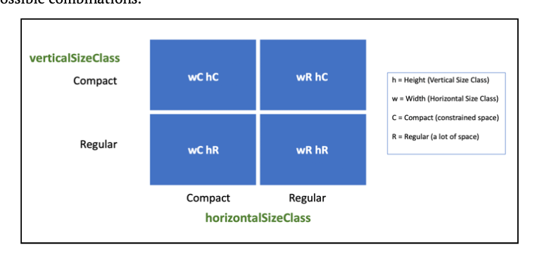
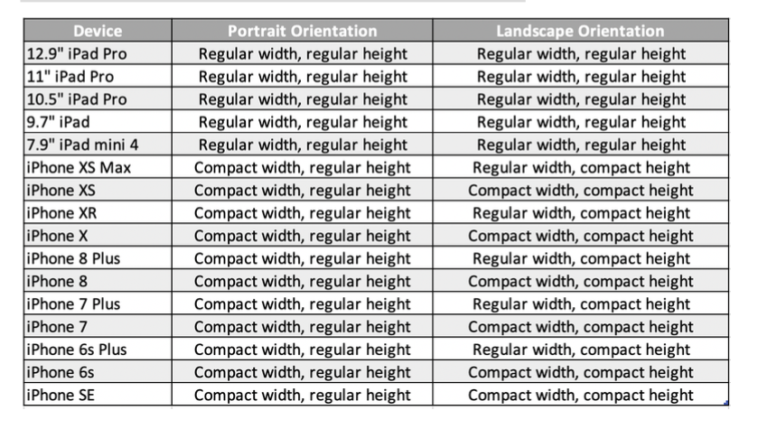

- Attributes
属性是“自动版式”用于在两个视图之间创建关系的视图功能。 有两种类型的属性：位置和大小。 位置属性包括视图的前缘，后缘，顶部和底部边缘。 大小属性包括视图的宽度和高度。 不同的用户界面具有不同的属性集。
- Multiplier
乘数是您可以应用于两个项目属性之间的关系的比率。 例如，您可以使标签B的高度是标签A高度的两倍。
- Constant
常数是您添加到约束中的固定值。 例如，标签A的前缘空间与超级视图的前缘相距16点。
- Priorities
有时，“自动布局”无法满足视图层次结构中应用的所有约束。在这种情况下，您可能会遇到视图争夺空间的情况。使用优先级，可以帮助自动布局解决这些布局决策。
- Constraint priority
约束优先级是关于哪个约束对自动版式更重要的是要满足。使用1到1000之间的值定义约束优先级。不需要使用1到999之间的约束优先级。要求约束优先级为1000。添加约束时，默认约束优先级为1000，这是必需的。
- Content hugging priorities
内容包含优先级可以帮助“自动布局”确定将哪个视图拉伸得大于其固有尺寸。每个视图都有一个包含优先级的水平和垂直内容。具有较高内容优先级的视图可以避免被拉伸，反之亦然。
在两个视图之间进行选择并确定要拉伸的视图时，布局引擎会调查包含优先级的内容。具有较低内容的视图具有优先级。视图的默认内容包含优先级因其类型和实例化视图的方式而异。使用Interface Builder和以编程方式实例化视图时，默认内容包含优先级可能会有所不同。

- Compression resistance priorities
压缩抗性优先级可帮助“自动版面配置”确定缩小的视图小于其固有尺寸。每个视图还具有水平和垂直压缩阻力优先级。具有较高抗压缩性优先级的视图可避免收缩，反之亦然。
每个视图都有默认的750水平和垂直压缩阻力优先级。与内容包含优先级不同，所有视图对象都具有相同的默认抗压缩性优先级，而与视图类型或实例化方法无关。在两个视图之间进行选择并决定缩小视图时，布局引擎会考虑抗压缩优先级。具有较低含量抗压缩优先级的视图缩小。

#### Stack View
###### `Alignment`控制着垂直于轴的视图布局,`Distribution`控制视图平行于轴的布局。

- Alignment 
	-  horizontal stack view
		-  `fill` alignment makes the views take up all of the vertical space inside the stack view.在每种情况下，最高视图的高度决定了堆栈视图的高度。并且由于对齐方式已填充，因此堆栈视图中的每个其他视图都与该高度匹配。
		-  Horizontal axis top, bottom and center alignments
		-  Horizontal axis first baseline and last baseline alignments
	-  Vertical axis alignments
		- leading, trailing, fill and center.
- distribution
	-  Fill: 调整子视图的大小以填充沿轴的所有空间，但是一个视图的大小可能与其他视图不同。
	-  Fill Equally:调整子视图的大小以填充沿轴的所有空间，但使每个子视图具有相同的大小。
	-  Fill Proportionally: 调整子视图的大小以填充沿轴的所有空间，但按其固有尺寸成比例地调整每个子视图的大小。
	-  Equal Spacing:根据子视图的固有大小或其他约束来调整子视图的大小，但要对其进行定位，以使每个子视图之间的间隔相等，并且至少要具有堆栈视图的Spacing属性。
	-  Equal Centering: 根据子视图的内在大小或其他约束来调整子视图的大小，但要放置它们，以使每个中心之间的距离相等。
	
#### Auto Layout with visual format language
##### Symbols
- `|` superview
- `-` standard spacing
-  `==` equal widths
-  `-20-` non-standard spacing (20 points)
-  `<=` less than or equal to
-  `>=` greater than or equal to
-  `@250` priority of the constraint; can have any value between 0 and 1000
- `250` - low priority
-  `750` - high priority
-  `1000` - required priority
###### 例子:
` H:|-[label(labelHeight)]-16-[imageView(>=250,<=300)]-16- [button(88@250)]-|`

- H：表示约束适用于水平排列。
- `|-[label`在父视图的前沿和标签的前沿之间创建约束。标签应在视图字典中找到。以下各节将详细介绍Views字典。
- `label(labelHeight）`将标签的高度设置为labelHeight。该密钥应在指标字典中找到。以下各节中将提供有关指标字典的更多信息。
- `]-16-[imageView`将标签的后沿与imageView的前沿之间设置16个间距的约束。
- `[imageView（>=250，<=300]`在imageView上设置一个大于或等于250约束且小于或等于300约束的宽度。
- `]-16-` [按钮在imageView的后缘和按钮的前缘之间设置16个间距限制。
- `[button(88@250]`为按钮提供了等于88的宽度限制，且优先级较低。这使“自动布局”引擎可以在需要时打破此约束。
- `]-|`在按钮的后沿和超级视图的后沿之间设置标准间距的约束。

#### Scrollview
关键点

- scroll view 和其视图层次结构之外的视图之间的约束作用于scroll view的frame。
- scroll view与其视图层次结构内的视图之间的约束作用于scroll view的content area。
- 设置scroll view的大小和位置时，请格外小心。 请记住，除了设置其大小和位置以外，您还必须指定一个内容区域，该区域将影响滚动视图的行为方式。
- 强烈建议添加一个内容视图，该视图充当滚动视图内部所有视图的容器。 这样可以更轻松地使用可能会增大大小的滚动视图。
- 在使用作为内容区域的滚动视图内部的堆栈视图（或任何视图）时，宽度和高度确定scroll view是否将进行垂直和水平滚动。
- 在为scroll view创建约束时，请记住使用frameLayoutGuide和contentLayoutGuide。

#### Self-Sizing-Views
###### bottom-to-top approach to size a UITableViewCell

要使用自动调整大小的单元，您需要遵循三个简单的规则：

- 1.将表格视图的rowHeight设置为UITableView.automaticDimension。
- 2.将表格视图的estimateRowHeight设置为所需的值，或者通过实现高度估计委托方法来执行此操作。
- 3.对单元格内的UI元素使用“自动布局”。 请记住，您必须在表视图单元格的内容视图内创建约束。 必须有不间断的约束链才能起作用。

#### Available Layout Guides
- 布局指南不是视觉元素，因为它们的工作只是在视图层次结构中定义矩形区域。
- 布局指南是使用代码创建的；这样可以进行更多的自定义，尤其是在代码中创建所有约束时。

- `Safe Area`
	- The Safe Area layout guide represents the portion of the screen that is not covered by the navigation bars, tab bars, and toolbars. “安全区域”布局指南表示导航栏，标签栏和工具栏未覆盖的屏幕部分。
- `Layout Margin`
	- `The Layout Margin` 表示视图的边距。 您可以使用它来创建对视图边距的约束，而不是视图本身。 
-  `Readable Content`
	- `The Readable Content guide `表示在应用程序中使用文本视图时可以使用的建议区域  
	- `The Readable Content guide` 南也很有用，因为它指定了可用于显示文本的总宽度。
	- the Readable Content Guide will never extend beyond the Layout Margin guide.
 
- ##### Creating layout guides
	- 实例化新的布局指南。
	- 通过调用addLayoutGuide（_ :)将其添加到其容器视图中。
	- 定义`the layout guide` 的约束。
除了在视图之间创建空间外，您还可以使用布局指南来包含其他视图。 当您要创建一个以一组视图为中心的容器时，这很有用。

####  content-hugging and compression-resistance priorities
内容拥抱优先级和抗压缩优先级

- 内容拥抱优先级表示视图必须增长到大于其固有内容大小的阻力。 
- 压缩抗性优先级表示视图必须缩小到其固有内容大小以外的抗性。

#### Size classes
horizontalSizeClass和verticalSizeClass。 这两个特征可以是`regular`，也可以是`compact`。 常规值表示可扩展的空间，这意味着有大量可用空间。 紧凑值表示空间受限，这意味着没有太多可用空间。`regular`:常规的,`compact`:紧凑的

#### Dynamic Type

